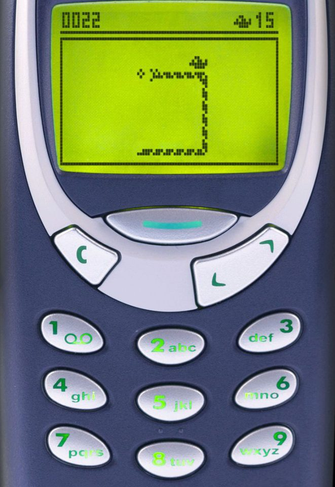

# Snake Game
As a student in the 2000s, I, like most students I knew, had a nokia 3310. A classic phone, virtually
indestructible, the phone had a long battery life, reasonable sound quality, it was the phone of the time.

Beyonds it's classic features, it had games on it, with the now legendary Snake 2.

credits - REX FEATURES

While a smiple game, snake captured the mood of the era, 'what's your high score in snake?' was a common
pub line students shared with each other. 

Snake itself is a somewhat simplistic game, a snake travels around the map, if it collides with a food
item it gets one unit longer and gains a point. The game continues until the snake collides either with
itself or the borders of the screen, although some versions had the snake warp across the border like 
pacman.

The purpose of this project was to recreate the classic snake game within a python terminal. The project
utilises curses to create the interface.

## Design Features

The snake game will have design features around the classic 
snake game rules. The following game rules are as follows:

1. The snake will always move forward unless a keypress is 
recorded.
2. The snake will change direction when a key of the direction
pad is pressed.
3. The exception is the opposite direction of travel of the snake
, as this would cause a gameover event.
4. Food will be placed on the map in a random coordinate.
5. When the snake hits the food, a point will be scored, the 
snake will get one unit longer, and a new piece of food will
be added to the map at a random point.
6. Gameover events will occur if the snake either hits a border
or it own tail.
7. After the gameover event, a gameover screen will show the
players score.

## User Experience

The user will:
- Load the game and reach a title screen wellcoming them to the
game.
- Start the game.
- Control the snake with the cursor keys, pause the game with p
and exit the game with x.
- Move the snake over food to increase the snakes size by 1, and
score a point.
- When the game ends, a gameover screen will be displayed to
show the player their final score.
- Pressing a key will restart the game.

## Credits
- https://patorjk.com/software/taag/#p=display&h=2&v=2&f=Slant&t=Snake ascii art for snake title page

- REX FEATURES for nokia snake 2 image

Snake game in python youtube vidoes:
- https://www.youtube.com/watch?v=M_npdRYD4K0&t=932s&ab_channel=PythonEngineer
- https://www.youtube.com/watch?v=tgt02bFoOu0&ab_channel=NathanJeanShow
- https://www.youtube.com/watch?v=BvbqI6eDh0c&ab_channel=IndianPythonista
- https://www.youtube.com/watch?v=rbasThWVb-c&ab_channel=EngineerMan

How to use python curses:
- https://www.youtube.com/watch?v=Db4oc8qc9RU&t=197s&ab_channel=TechWithTim
- https://docs.python.org/3/howto/curses.html

## bug
- While code prevented right and down keystrokes from doubling back, left and up keystrokes would result in gameover.
## solution
- changed code to directly interact at the keystoke entry. This fixed the code.

## bug
- curses.curs_set(0) caused an error in Heroku application
## solution
- no solution, had to remove curses.curs_set() function.

