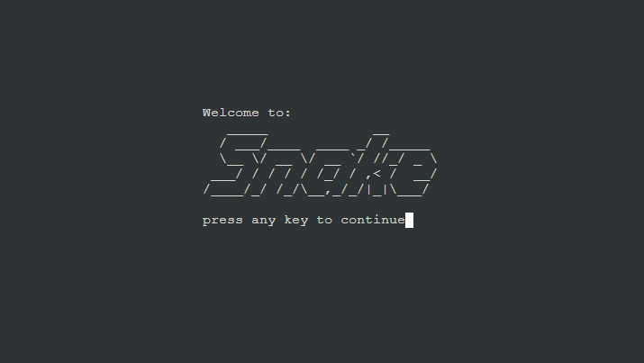
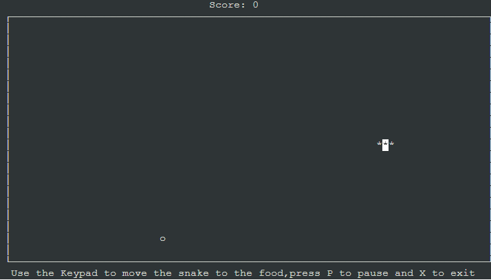

# Snake Game
As a student in the 2000s, I, like most students I knew, had a nokia 3310. A classic phone, virtually
indestructible, the phone had a long battery life, reasonable sound quality, it was the phone of the time.

Beyonds it's classic features, it had games on it, with the now legendary Snake 2.

credits - REX FEATURES

While a smiple game, snake captured the mood of the era, 'what's your high score in snake?' was a common
pub line students shared with each other. 

Snake itself is a somewhat simplistic game, a snake travels around the map, if it collides with a food
item it gets one unit longer and gains a point. The game continues until the snake collides either with
itself or the borders of the screen, although some versions had the snake warp across the border like 
pacman.

The purpose of this project was to recreate the classic snake game within a python terminal. The project
utilises curses to create the interface.

## Design Features

The snake game will have design features around the classic 
snake game rules. The following game rules are as follows:

1. The snake will always move forward unless a keypress is  recorded.
2. The snake will change direction when a key of the direction pad is pressed.
3. The exception is the opposite direction of travel of the snake , as this would cause a gameover event.
4. Food will be placed on the map in a random coordinate.
5. When the snake hits the food, a point will be scored, the snake will get one unit longer, and a new 
piece of food will be added to the map at a random point.
6. Gameover events will occur if the snake either hits a border or it own tail.
7. After the gameover event, a gameover screen will show the players score.

## User Experience

The user will:
- Load the game and reach a title screen wellcoming them to the
game.
- Start the game.
- Control the snake with the cursor keys, pause the game with p
and exit the game with x.
- Move the snake over food to increase the snakes size by 1, and
score a point.
- When the game ends, a gameover screen will be displayed to
show the player their final score.
- Pressing a key will restart the game.

## Coding

Snake is a relatively straightforward game, with a single user input and no AI required, just random
placement of food.

The code is broken into 3 subfunctions, relating to each specific screen.

- Intro
- Game
- Scores

### Intro

The intro screen has ascii art of the name Snake, and a press any key to continue.

Using the curses setup, the screen is established via stdscr, and a the texbox is 
situated in the middle of the screen

### Game

The game function is the core function.

Firstly it sets up 3 windows in the terminal, the score window, the game_area window
and the instructions window. Using the stdscr refresh the screens.

The snake is initalised 3 coordinates long in a set place heading left.

A piece of food is added at a random location via random.randint.

Then an infinite loop is generated while the game is running.

The infinite loop is setup to run until the x (or X) key is pressed.

Keystrokes will be recorded, with the arrow keys causing an event. If there is no
keystroke in a set time frame (150), then the previous key event is used. IE if the 
snake is moving left, and no keystroke is detected in the time intervel, then the 
progam will continue as if a left keystoke had been recorded.

The next set of instructions check if the arrow key is the opposite direction of the
snake, ie if the keystroke is left, and the snake is traveling right. If this is 
found to be the case, then the keystroke is ignored, as doubling back on itself would
cause a gameover event.

Following this it moves the snake head to the next coordinate. There is a check to see 
if the new coordinate head of the snake is either out of bounds (at the border of the 
game_area) or if the head has hit it's own tail. If this has happened then the score() 
function is called and the gameover screen is loaded.

After this check, the code then checks to see if the new head is at the same coordinate
as the food, if this is the case, then the score is updated, a new food is generated at
random coordinates. If the food coordinates are generated inside the snake, the food 
generation process is repeated. 

This process creates a new snake part, and would make the snake become larger at each
event, as this is not standard of the game rules of snake, the final part of the game
function pops the last part of the snake off unless the snake head is has hit the food
at this event. As such head is generated each event, and the last tail is popped off 
unless the head is generated onto food, whereby the tail is retained.

### Score

The score function is called when a gameover event is reached. This screen is similar
to the Intro screen, however it has gameover, and score.

Pressing a key will restart the main() function, taking the player back to the title
screen.

## Testing

The game has been tested in Github terminal on a PC using the github web interface.

Following deployment to Heroku, the game was tested on a PC using Chrome as a web
interface.

## Deployment

The game has been deployed on Heroku, and can be found at:

https://curses-snake.herokuapp.com/

## Credits
- https://patorjk.com/software/taag/#p=display&h=2&v=2&f=Slant&t=Snake ascii art for snake title page

- REX FEATURES for nokia snake 2 image

Snake game in python youtube vidoes:
- https://www.youtube.com/watch?v=M_npdRYD4K0&t=932s&ab_channel=PythonEngineer
- https://www.youtube.com/watch?v=tgt02bFoOu0&ab_channel=NathanJeanShow
- https://www.youtube.com/watch?v=BvbqI6eDh0c&ab_channel=IndianPythonista
- https://www.youtube.com/watch?v=rbasThWVb-c&ab_channel=EngineerMan

How to use python curses:
- https://www.youtube.com/watch?v=Db4oc8qc9RU&t=197s&ab_channel=TechWithTim
- https://docs.python.org/3/howto/curses.html

## Future features

- Add colour - the title screen has been colored, but the rest of the game is monochrome.

- Add perm highscore table - using Googlesheets to create a permenant highscore table that will allow players to compete
against themselves and other players.

- Add difficulty - difficulty plan 1 - game speed increase
difficulty plan 2 - gameover even (poison food) that spawns for a set amount of time.

## Bugs

### bug
- While code prevented right and down keystrokes from doubling back, left and up keystrokes would result in gameover.
### solution
- changed code to directly interact at the keystoke entry. This fixed the code.

### bug
- curses.curs_set(0) caused an error in Heroku application
### solution
- no solution, had to remove curses.curs_set() function.

### bug
- Heroku wasing loading gspread
### solution
- no solution found.

